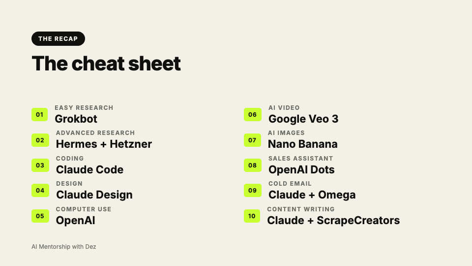

# The Only AI Tools You Need in 2026

One pick for each of 10 jobs, from the AI Mentorship for World Travelers episode with Desmond Dixon.

**[Download the presentation (PDF)](the-only-ai-tools-you-need-2026.pdf)**

Watch the episode (live from October 8, 2026): https://youtu.be/QhuS-RXC9KM

## The cheat sheet

| Job | My pick |
| --- | --- |
| Easy research | Grokbot |
| Advanced research | Hermes Agent on a Hetzner server |
| Coding | Claude Code |
| Design | Claude Design |
| Computer use | OpenAI (ChatGPT with GPT-6 Astra) |
| AI video | Google Veo 3 |
| AI images | Google Nano Banana |
| Sales assistant | OpenAI Dots |
| Cold email | Claude with a second brain for business context |
| Content writing | Claude with the ScrapeCreators API |

## If I only had $100

Start with Claude. Add Google if you make a lot of images and video. If you are focused on sales, ChatGPT can be enough. Hermes is open source, so run it on a small server when you are ready to build your own automations.

## More free resources

The free AI business launch kits: https://github.com/desmond-netizen/ai-business-launch-kits

For education only. These are one person's opinions from his own work as of October 2026, not a benchmark. Tools and prices change, and your results may differ. No earnings or client guarantees.
